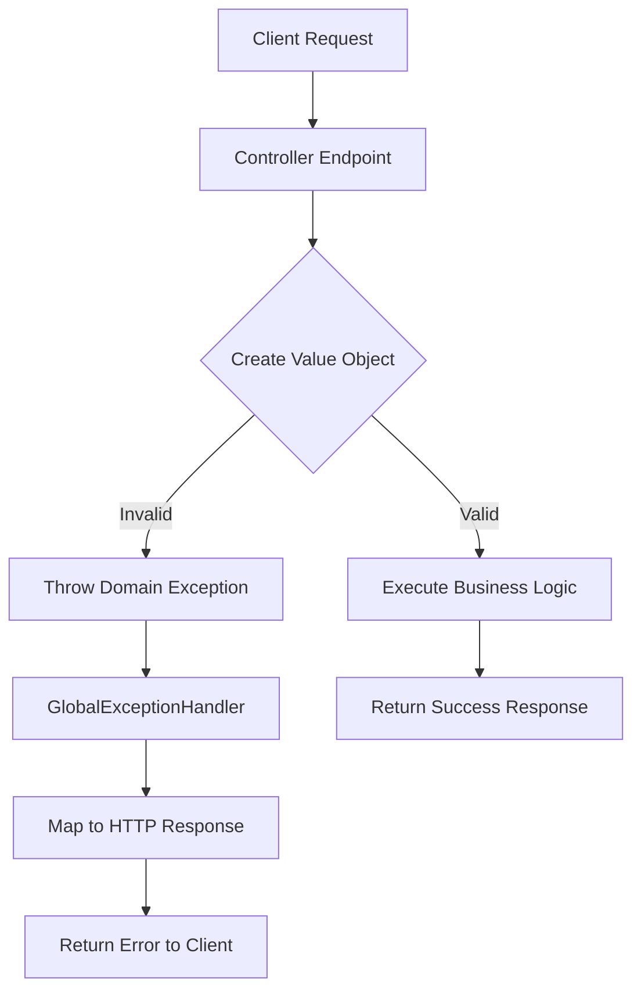

## Overview

The E-Commerce API implements a centralized exception handling mechanism using Spring's `@ControllerAdvice` to provide consistent error responses across all endpoints. This ensures that clients receive predictable, well-formatted error messages for various failure scenarios.

## Global Exception Handler

The `GlobalExceptionHandler` class (located at `src/main/java/com/example/demo/core/infrastructures/exceptionhandler/GlobalExceptionHandler.java:10`) serves as the central exception handling mechanism for the entire API.

<Note>
All exceptions are intercepted and transformed into appropriate HTTP responses with status codes and descriptive error messages.
</Note>

### Architecture

```java
@ControllerAdvice
public class GlobalExceptionHandler {
    @ExceptionHandler(InvalidPasswordException.class)
    public ResponseEntity<String> handleInvalidPasswordException(InvalidPasswordException ex) {
        return ResponseEntity
                .status(HttpStatus.BAD_REQUEST)
                .body(ex.getMessage());
    }
}
```

The handler uses Spring's `@ControllerAdvice` annotation to apply exception handling globally across all controllers, ensuring consistent error responses throughout the API.

## Domain Exceptions

### InvalidPasswordException

The `InvalidPasswordException` is thrown when password validation fails during user registration or password updates.

<ResponseField name="status_code" type="number" required>
  **400** - Bad Request
</ResponseField>

<ResponseField name="response_body" type="string" required>
  Plain text error message describing the specific validation failure
</ResponseField>

#### When This Exception Occurs

This exception is raised in the `ContrasenaVO` value object (`src/main/java/com/example/demo/usuario/domain/vo/ContrasenaVO.java:8`) when creating or updating a password that fails validation rules.

<Accordion title="Password Validation Rules">
  The password must satisfy ALL of the following criteria:

  1. **Not Empty**: Password cannot be null or empty string
     - Error: `"La contraseña no puede estar vacía"`

  2. **Minimum Length**: Must be at least 8 characters
     - Error: `"La contraseña debe tener al menos 8 caracteres"`

  3. **Maximum Length**: Cannot exceed 64 characters
     - Error: `"La contraseña no puede superar los 64 caracteres"`

  4. **Complexity**: Must contain at least one letter (A-Z, a-z) AND one digit (0-9)
     - Error: `"La contraseña debe contener al menos una letra y un número"`
</Accordion>

#### Example Error Responses

**Empty Password**
```http
POST /registro
Content-Type: application/json

{
  "usuario": "john.doe",
  "contrasena": ""
}
```

Response:
```http
HTTP/1.1 400 Bad Request
Content-Type: text/plain

La contraseña no puede estar vacía
```

**Password Too Short**
```http
POST /registro
Content-Type: application/json

{
  "usuario": "john.doe",
  "contrasena": "abc123"
}
```

Response:
```http
HTTP/1.1 400 Bad Request
Content-Type: text/plain

La contraseña debe tener al menos 8 caracteres
```

**Missing Complexity Requirements**
```http
POST /registro
Content-Type: application/json

{
  "usuario": "john.doe",
  "contrasena": "abcdefgh"
}
```

Response:
```http
HTTP/1.1 400 Bad Request
Content-Type: text/plain

La contraseña debe contener al menos una letra y un número
```

**Valid Password**
```http
POST /registro
Content-Type: application/json

{
  "usuario": "john.doe",
  "contrasena": "SecurePass123"
}
```

Response:
```http
HTTP/1.1 200 OK
Content-Type: application/json

{
  "usuario": "john.doe",
  "contrasena": "****"
}
```

<Warning>
Password validation occurs at the domain layer within the `ContrasenaVO` value object constructor, ensuring that invalid passwords are rejected before any business logic executes.
</Warning>

## Value Object Validation

### IllegalArgumentException

While not explicitly handled by the `GlobalExceptionHandler`, the API uses standard `IllegalArgumentException` for other value object validations, such as price validation in `PrecioVO` (`src/main/java/com/example/demo/producto/domain/vo/PrecioVO.java:6`).

<Note>
Standard Spring exception handling will catch `IllegalArgumentException` and return a 500 Internal Server Error by default. Consider adding an explicit handler for this exception type in production environments.
</Note>

#### Price Validation Rules

The `PrecioVO` value object enforces:

1. **Not Null**: Price cannot be null
   - Error: `"El precio no puede ser nulo"`

2. **Non-Negative**: Price must be greater than or equal to 0
   - Error: `"El precio no puede ser negativo"`

## Error Response Format

### Current Implementation

The API currently returns error messages as **plain text strings** in the response body.

**Example:**
```http
HTTP/1.1 400 Bad Request
Content-Type: text/plain

La contraseña debe tener al menos 8 caracteres
```

### Best Practices for Production

<Warning>
For production environments, consider implementing a structured JSON error response format for better client-side error handling and internationalization support.
</Warning>

**Recommended JSON Error Format:**
```json
{
  "error": {
    "code": "INVALID_PASSWORD_LENGTH",
    "message": "La contraseña debe tener al menos 8 caracteres",
    "field": "contrasena",
    "timestamp": "2026-03-06T10:30:00Z"
  }
}
```

## Exception Handling Flow



1. **Request Reception**: Client sends request to controller endpoint
2. **Value Object Creation**: Domain value objects (ContrasenaVO, PrecioVO) perform validation in constructors
3. **Exception Raised**: Validation failure throws domain exception
4. **Global Handler Intercepts**: `@ControllerAdvice` catches the exception
5. **HTTP Response Mapped**: Exception is converted to appropriate HTTP status and message
6. **Client Receives Error**: Consistent error format returned to client

## HTTP Status Codes

The API uses the following HTTP status codes for error responses:

<ResponseField name="400" type="Bad Request">
  Validation errors, invalid input data, or business rule violations
  - `InvalidPasswordException` - Password validation failures
  - `IllegalArgumentException` - Value object validation failures (e.g., invalid price)
</ResponseField>

<ResponseField name="500" type="Internal Server Error">
  Unhandled exceptions and unexpected errors
  - Exceptions not explicitly caught by `GlobalExceptionHandler`
</ResponseField>

## Extending Exception Handling

To add custom exception handling:

1. **Create a Custom Exception Class**
   ```java
   public class ResourceNotFoundException extends RuntimeException {
       public ResourceNotFoundException(String message) {
           super(message);
       }
   }
   ```

2. **Add Handler Method to GlobalExceptionHandler**
   ```java
   @ExceptionHandler(ResourceNotFoundException.class)
   public ResponseEntity<String> handleResourceNotFoundException(ResourceNotFoundException ex) {
       return ResponseEntity
               .status(HttpStatus.NOT_FOUND)
               .body(ex.getMessage());
   }
   ```

3. **Throw Exception in Domain Logic**
   ```java
   if (usuario == null) {
       throw new ResourceNotFoundException("Usuario no encontrado");
   }
   ```

## Related Endpoints

- [User Registration](/api/user-endpoints#post-registro) - Can trigger `InvalidPasswordException`
- [User Login](/api/user-endpoints#get-loginusuariocontrasena) - Can trigger `InvalidPasswordException`

## Security Considerations

<Warning>
Be cautious about exposing detailed error messages in production environments, as they may leak sensitive information about the system's internal structure or validation rules.
</Warning>

**Recommendations:**
- Log detailed error information server-side for debugging
- Return generic error messages to clients in production
- Implement rate limiting on endpoints that trigger validation errors to prevent abuse
- Never expose stack traces in API responses
