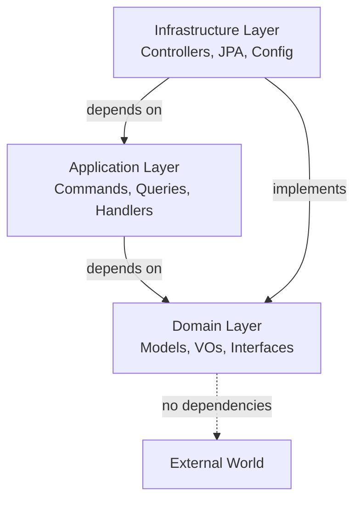

## Overview

This E-Commerce Backend API is built using **Clean Architecture** principles, which organize code into concentric layers with clear boundaries and dependencies flowing inward. This architectural pattern ensures that business logic remains independent of frameworks, databases, and external systems.

<Info>
**Dependency Rule**: Source code dependencies can only point inward. Inner layers know nothing about outer layers.
</Info>

## Architecture Layers

The codebase is organized into three main layers within each module:

<CardGroup cols={3}>
  <Card title="Domain Layer" icon="gem">
    Core business logic and rules
  </Card>
  <Card title="Application Layer" icon="layer-group">
    Use cases and orchestration
  </Card>
  <Card title="Infrastructure Layer" icon="server">
    External concerns and frameworks
  </Card>
</CardGroup>

## Layer Structure

Each module (e.g., `usuario`, `producto`) follows this structure:

```
com.example.demo.usuario/
├── domain/
│   ├── models/          # Business entities (POJOs)
│   ├── vo/              # Value Objects
│   ├── repositories/    # Repository interfaces
│   └── exceptions/      # Domain-specific exceptions
├── application/
│   ├── commands/        # Write operations
│   ├── querys/          # Read operations
│   └── usecases/        # Business use cases
└── infrastructure/
    ├── controllers/     # REST API endpoints
    ├── entities/        # JPA entities
    ├── repositories/    # Repository implementations
    └── config/          # Framework configuration
```

## Domain Layer

The **Domain Layer** contains the core business logic and is completely independent of any framework or external system.

### Domain Models

Domain models represent business entities using POJOs (Plain Old Java Objects):

```java src/main/java/com/example/demo/usuario/domain/models/UsuarioPOJO.java
package com.example.demo.usuario.domain.models;

import com.example.demo.usuario.domain.vo.ContrasenaVO;
import lombok.AllArgsConstructor;
import lombok.Getter;
import lombok.NoArgsConstructor;
import lombok.Setter;

@AllArgsConstructor
@NoArgsConstructor
@Getter
@Setter
public class UsuarioPOJO {
    private Long id;
    private String usuario;
    private ContrasenaVO contrasena;
}
```

<Note>
Domain models use **Value Objects** for complex types, ensuring validation and business rules are encapsulated.
</Note>

### Repository Interfaces

The domain defines repository contracts without knowing how they're implemented:

```java src/main/java/com/example/demo/usuario/domain/repositories/UsuarioRepository.java
package com.example.demo.usuario.domain.repositories;

import com.example.demo.usuario.domain.models.UsuarioPOJO;

public interface UsuarioRepository {
    UsuarioPOJO findUsuarioByUsuarioYContrasena(String usuario, String contrasena);
    UsuarioPOJO saveUsuario(String usuario, String contrasena);
}
```

## Application Layer

The **Application Layer** orchestrates business use cases and coordinates between the domain and infrastructure layers.

### Commands and Queries (CQRS)

This layer implements the CQRS pattern with separate handlers:

```java src/main/java/com/example/demo/usuario/application/commands/handlers/RegistrarUsuarioHandler.java
package com.example.demo.usuario.application.commands.handlers;

import org.springframework.stereotype.Service;
import com.example.demo.usuario.application.commands.RegistrarUsuarioCommand;
import com.example.demo.usuario.domain.models.UsuarioPOJO;
import com.example.demo.usuario.domain.repositories.UsuarioRepository;

@Service
public class RegistrarUsuarioHandler {

    private final UsuarioRepository usuarioRepository;

    public RegistrarUsuarioHandler(UsuarioRepository usuarioRepository) {
        this.usuarioRepository = usuarioRepository;
    }

    public UsuarioPOJO handle(RegistrarUsuarioCommand command) {
        return usuarioRepository.saveUsuario(
            command.getUsuario(), 
            command.getContrasena().getValue()
        );
    }
}
```

<Info>
Handlers depend on **domain repository interfaces**, not concrete implementations. This maintains the dependency inversion principle.
</Info>

## Infrastructure Layer

The **Infrastructure Layer** contains all external concerns and framework-specific code.

### JPA Entities

Infrastructure entities handle database persistence:

```java src/main/java/com/example/demo/usuario/infrastructure/entities/UsuarioEntity.java
@Entity
@Table(name = "Usuario")
public class UsuarioEntity {

    @Id
    @GeneratedValue(strategy = GenerationType.IDENTITY)
    private Long idUsuario;
    
    @Column(name = "usuario")
    private String usuario;
    
    @Column(name = "contrasena")
    private String contrasena;
    
    public UsuarioPOJO toDomain() {
        return new UsuarioPOJO(
            this.idUsuario, 
            this.usuario, 
            new ContrasenaVO(this.contrasena)
        );
    }
    
    public static UsuarioEntity fromDomain(UsuarioPOJO usuario) {
        return new UsuarioEntity(
            usuario.getId(), 
            usuario.getUsuario(), 
            usuario.getContrasena().getValue()
        );
    }
}
```

<Note>
**Mapper Methods**: `toDomain()` and `fromDomain()` convert between infrastructure entities and domain models, maintaining separation of concerns.
</Note>

### Repository Adapters

Adapters implement domain repository interfaces using Spring Data JPA:

```java src/main/java/com/example/demo/usuario/infrastructure/repositories/UsuarioAdapterRepository.java
@Repository
public class UsuarioAdapterRepository implements UsuarioRepository {

    private final UsuarioJPARepository usuarioJPARepository;

    public UsuarioAdapterRepository(UsuarioJPARepository usuarioJPARepository) {
        this.usuarioJPARepository = usuarioJPARepository;
    }

    @Override
    public UsuarioPOJO findUsuarioByUsuarioYContrasena(String usuario, String contrasena) {
        return usuarioJPARepository
            .findByUsuarioAndContrasena(usuario, contrasena)
            .toDomain();
    }

    @Override
    public UsuarioPOJO saveUsuario(String usuario, String contrasena) {
        UsuarioEntity usuarioEntity = new UsuarioEntity(usuario, contrasena);
        return usuarioJPARepository.save(usuarioEntity).toDomain();
    }
}
```

### REST Controllers

Controllers handle HTTP requests and delegate to application handlers:

```java src/main/java/com/example/demo/usuario/infrastructure/controllers/UsuarioRestController.java
@RestController
public class UsuarioRestController {

    private final RegistrarUsuarioHandler registrarUsuarioHandler;
    private final LoginUsuarioHandler loginUsuarioHandler;

    public UsuarioRestController(
        RegistrarUsuarioHandler registrarUsuarioHandler, 
        LoginUsuarioHandler loginUsuarioHandler
    ) {
        this.registrarUsuarioHandler = registrarUsuarioHandler;
        this.loginUsuarioHandler = loginUsuarioHandler;
    }

    @PostMapping("/registro")
    public UsuarioPOJO registroUsuario(@RequestBody RegistrarUsuarioRequest request) {
        RegistrarUsuarioCommand command = new RegistrarUsuarioCommand(
            request.usuario(), 
            new ContrasenaVO(request.contrasena())
        );
        return registrarUsuarioHandler.handle(command);
    }

    @GetMapping("/login/{usuario}/{contrasena}")
    public UsuarioPOJO loginUsuario(
        @PathVariable String usuario, 
        @PathVariable String contrasena
    ) {
        LoginUsuarioQuery query = new LoginUsuarioQuery(usuario, contrasena);
        return loginUsuarioHandler.handle(query);
    }
}
```

## Benefits

<Accordion title="Independence from Frameworks">
Business logic doesn't depend on Spring, JPA, or any other framework. You can change frameworks without rewriting business rules.
</Accordion>

<Accordion title="Testability">
Domain and application layers can be tested without databases, web frameworks, or external systems.
</Accordion>

<Accordion title="Independent Development">
Teams can work on different layers simultaneously with minimal conflicts.
</Accordion>

<Accordion title="Flexibility">
Infrastructure can be swapped (e.g., PostgreSQL to MongoDB) without affecting business logic.
</Accordion>

## Dependency Flow



<Info>
The **Domain Layer** has zero dependencies on outer layers, making it the most stable and reusable part of the system.
</Info>

## Related Concepts

<CardGroup cols={2}>
  <Card title="CQRS Pattern" icon="arrows-split-up-and-left" href="/concepts/cqrs-pattern">
    Learn how Commands and Queries separate write and read operations
  </Card>
  <Card title="Value Objects" icon="shield-check" href="/concepts/value-objects">
    Understand how VOs encapsulate validation and business rules
  </Card>
</CardGroup>
