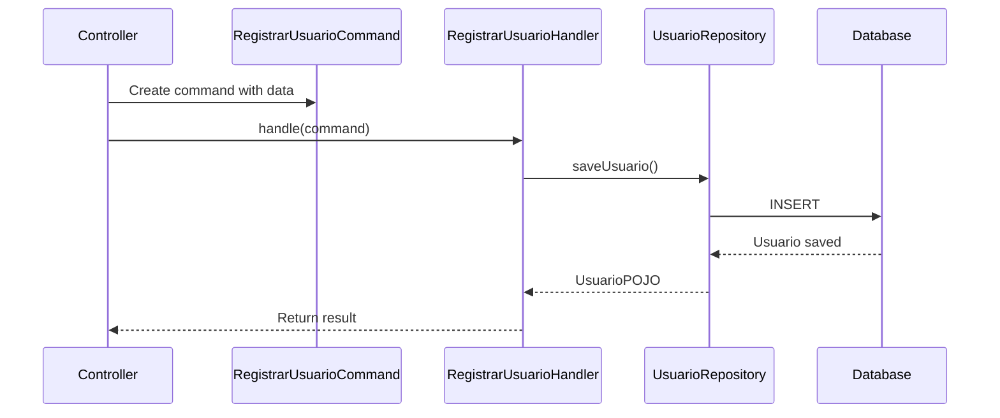
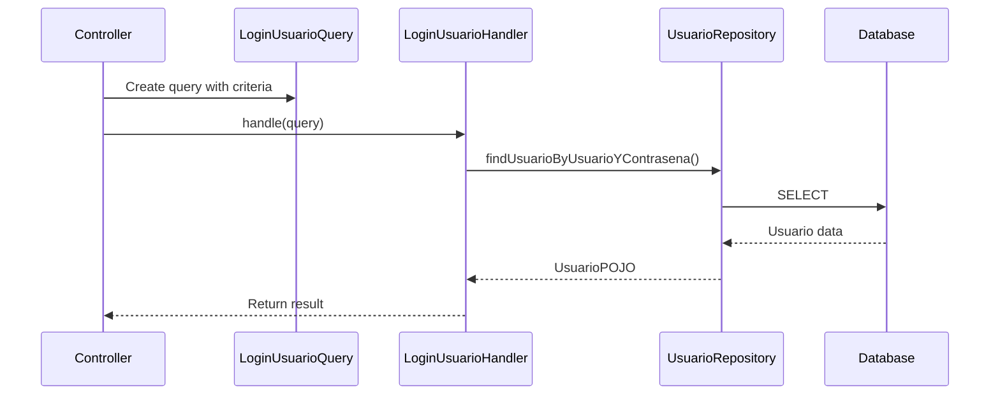
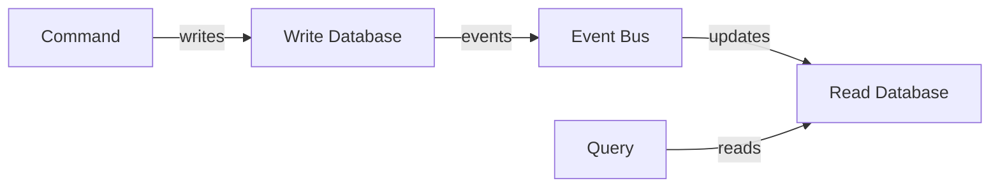

## Overview

**CQRS (Command Query Responsibility Segregation)** is a pattern that separates read operations (Queries) from write operations (Commands). This API implements CQRS in the application layer to clearly distinguish between operations that modify state and those that only retrieve data.

<Info>
**Core Principle**: A method should either change the state of the system (Command) or return data (Query), but never both.
</Info>

## Commands vs Queries

<CardGroup cols={2}>
  <Card title="Commands" icon="pen-to-square" color="#ea5a0c">
    Write operations that modify system state
    - Create, Update, Delete
    - Return void or simple acknowledgment
    - Can trigger side effects
  </Card>
  <Card title="Queries" icon="magnifying-glass" color="#0285c7">
    Read operations that retrieve data
    - Select, Find, Get
    - Never modify state
    - Return data models
  </Card>
</CardGroup>

## Commands

Commands represent **write operations** that change the system's state.

### Command Structure

Commands are simple data transfer objects that encapsulate the parameters for a write operation:

```java src/main/java/com/example/demo/usuario/application/commands/RegistrarUsuarioCommand.java
package com.example.demo.usuario.application.commands;

import com.example.demo.usuario.domain.vo.ContrasenaVO;
import lombok.AllArgsConstructor;
import lombok.Getter;
import lombok.Setter;

@Setter
@Getter
@AllArgsConstructor
public class RegistrarUsuarioCommand {
    private String usuario;
    private ContrasenaVO contrasena;
}
```

<Note>
Commands use **Value Objects** (like `ContrasenaVO`) to ensure data is validated before reaching the handler.
</Note>

### Command Handler

Handlers process commands and execute the business logic:

```java src/main/java/com/example/demo/usuario/application/commands/handlers/RegistrarUsuarioHandler.java
package com.example.demo.usuario.application.commands.handlers;

import org.springframework.stereotype.Service;
import com.example.demo.usuario.application.commands.RegistrarUsuarioCommand;
import com.example.demo.usuario.domain.models.UsuarioPOJO;
import com.example.demo.usuario.domain.repositories.UsuarioRepository;

@Service
public class RegistrarUsuarioHandler {

    private final UsuarioRepository usuarioRepository;

    public RegistrarUsuarioHandler(UsuarioRepository usuarioRepository) {
        this.usuarioRepository = usuarioRepository;
    }

    public UsuarioPOJO handle(RegistrarUsuarioCommand command) {
        return usuarioRepository.saveUsuario(
            command.getUsuario(), 
            command.getContrasena().getValue()
        );
    }
}
```

### Command Flow



## Queries

Queries represent **read operations** that retrieve data without modifying state.

### Query Structure

Queries contain the parameters needed to fetch data:

```java src/main/java/com/example/demo/usuario/application/querys/LoginUsuarioQuery.java
package com.example.demo.usuario.application.querys;

import lombok.AllArgsConstructor;
import lombok.Getter;
import lombok.Setter;

@Getter
@Setter
@AllArgsConstructor
public class LoginUsuarioQuery {
    private String usuario;
    private String contrasena;
}
```

### Query Handler

Handlers execute read operations:

```java src/main/java/com/example/demo/usuario/application/querys/handlers/LoginUsuarioHandler.java
package com.example.demo.usuario.application.querys.handlers;

import org.springframework.stereotype.Service;
import com.example.demo.usuario.application.querys.LoginUsuarioQuery;
import com.example.demo.usuario.domain.models.UsuarioPOJO;
import com.example.demo.usuario.domain.repositories.UsuarioRepository;

@Service
public class LoginUsuarioHandler {

    private final UsuarioRepository usuarioRepository;

    public LoginUsuarioHandler(UsuarioRepository usuarioRepository) {
        this.usuarioRepository = usuarioRepository;
    }

    public UsuarioPOJO handle(LoginUsuarioQuery query) {
        return usuarioRepository.findUsuarioByUsuarioYContrasena(
            query.getUsuario(), 
            query.getContrasena()
        );
    }
}
```

### Query Flow



## Controller Integration

Controllers use both command and query handlers to implement API endpoints:

```java src/main/java/com/example/demo/usuario/infrastructure/controllers/UsuarioRestController.java
@RestController
public class UsuarioRestController {

    private final RegistrarUsuarioHandler registrarUsuarioHandler;
    private final LoginUsuarioHandler loginUsuarioHandler;

    public UsuarioRestController(
        RegistrarUsuarioHandler registrarUsuarioHandler, 
        LoginUsuarioHandler loginUsuarioHandler
    ) {
        this.registrarUsuarioHandler = registrarUsuarioHandler;
        this.loginUsuarioHandler = loginUsuarioHandler;
    }

    // Command endpoint - Writes data
    @PostMapping("/registro")
    public UsuarioPOJO registroUsuario(@RequestBody RegistrarUsuarioRequest request) {
        RegistrarUsuarioCommand command = new RegistrarUsuarioCommand(
            request.usuario(), 
            new ContrasenaVO(request.contrasena())
        );
        return registrarUsuarioHandler.handle(command);
    }

    // Query endpoint - Reads data
    @GetMapping("/login/{usuario}/{contrasena}")
    public UsuarioPOJO loginUsuario(
        @PathVariable String usuario, 
        @PathVariable String contrasena
    ) {
        LoginUsuarioQuery query = new LoginUsuarioQuery(usuario, contrasena);
        return loginUsuarioHandler.handle(query);
    }
}
```

<Info>
Notice how **POST** requests use Commands (write) while **GET** requests use Queries (read).
</Info>

## Directory Organization

The CQRS pattern is reflected in the project structure:

```
application/
├── commands/
│   ├── RegistrarUsuarioCommand.java
│   └── handlers/
│       └── RegistrarUsuarioHandler.java
└── querys/
    ├── LoginUsuarioQuery.java
    └── handlers/
        └── LoginUsuarioHandler.java
```

## Benefits

<Accordion title="Clear Separation of Concerns">
Read and write operations are isolated, making code easier to understand and maintain.
</Accordion>

<Accordion title="Independent Scaling">
Read and write operations can be scaled independently based on traffic patterns.
</Accordion>

<Accordion title="Optimized Data Models">
Commands and Queries can use different data models optimized for their specific needs.
</Accordion>

<Accordion title="Better Security">
Easier to implement security policies (e.g., read-only users can only execute queries).
</Accordion>

<Accordion title="Event Sourcing Ready">
CQRS naturally leads to event-driven architectures and event sourcing patterns.
</Accordion>

## When to Use CQRS

### Good Use Cases

- Systems with complex business logic
- Applications with different read/write performance requirements
- Domain-driven design implementations
- Event-sourced systems

### Avoid When

- Simple CRUD applications
- Projects with limited team experience
- Systems where read and write models are identical

## CQRS Best Practices

<Note>
**Naming Conventions**
- Commands: Use imperative verbs (e.g., `RegistrarUsuarioCommand`, `ActualizarProductoCommand`)
- Queries: Use descriptive nouns (e.g., `LoginUsuarioQuery`, `ObtenerProductoQuery`)
</Note>

<Note>
**Handler Responsibilities**
- One handler per command/query
- Handlers should be thin, delegating to domain services
- Use dependency injection for repositories
</Note>

<Note>
**Validation**
- Commands validate using Value Objects at creation time
- Handlers should assume incoming data is valid
- Business rule validation happens in the domain layer
</Note>

## Advanced: Eventual Consistency

In advanced CQRS implementations, write and read models can be completely separate:



This API uses a **simplified CQRS** approach where commands and queries share the same database but maintain logical separation in the application layer.

## Related Concepts

<CardGroup cols={2}>
  <Card title="Clean Architecture" icon="layer-group" href="/concepts/clean-architecture">
    See how CQRS fits into the application layer
  </Card>
  <Card title="Value Objects" icon="shield-check" href="/concepts/value-objects">
    Learn how VOs validate data in Commands
  </Card>
</CardGroup>
