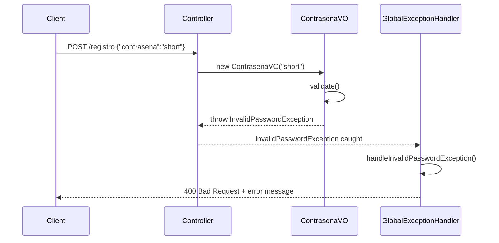

This guide explains the error handling architecture, including the `GlobalExceptionHandler` and custom exceptions for validation and business logic errors.

## Overview

The API uses Spring's `@ControllerAdvice` for centralized exception handling, providing consistent error responses across all endpoints.

### Key Components

- **GlobalExceptionHandler**: Centralized exception handler
- **InvalidPasswordException**: Custom exception for password validation
- **HTTP Status Codes**: RESTful error responses

## GlobalExceptionHandler

The `GlobalExceptionHandler` class handles exceptions thrown from any controller:

```java
package com.example.demo.core.infrastructures.exceptionhandler;

import org.springframework.http.HttpStatus;
import org.springframework.http.ResponseEntity;
import org.springframework.web.bind.annotation.ControllerAdvice;
import org.springframework.web.bind.annotation.ExceptionHandler;

import com.example.demo.usuario.domain.exceptions.InvalidPasswordException;

@ControllerAdvice
public class GlobalExceptionHandler {

    @ExceptionHandler(InvalidPasswordException.class)
    public ResponseEntity<String> handleInvalidPasswordException(InvalidPasswordException ex) {
        return ResponseEntity
                .status(HttpStatus.BAD_REQUEST)
                .body(ex.getMessage());
    }
}
```

### How It Works

<Steps>
  <Step title="Exception is Thrown">
    An exception (e.g., `InvalidPasswordException`) is thrown from any layer of the application:
    
    ```java
    throw new InvalidPasswordException("La contraseña debe tener al menos 8 caracteres");
    ```
  </Step>

  <Step title="Handler Intercepts">
    Spring intercepts the exception and routes it to the appropriate `@ExceptionHandler` method based on exception type.
  </Step>

  <Step title="Response is Built">
    The handler method constructs a `ResponseEntity` with:
    - HTTP status code (e.g., 400 Bad Request)
    - Error message from the exception
  </Step>

  <Step title="Client Receives Error">
    The error response is sent to the client in a consistent format.
  </Step>
</Steps>

## Custom Exceptions

### InvalidPasswordException

Thrown when password validation fails in `ContrasenaVO`:

```java
package com.example.demo.usuario.domain.exceptions;

public class InvalidPasswordException extends RuntimeException {
    
    public InvalidPasswordException(String message) {
        super(message);
    }
}
```

#### When It's Thrown

The `ContrasenaVO` class throws this exception for validation failures:

```java
public ContrasenaVO(String value) {
    if (value == null || value.isEmpty()) {
        throw new InvalidPasswordException("La contraseña no puede estar vacía");
    }
    if (value.length() < 8) {
        throw new InvalidPasswordException("La contraseña debe tener al menos 8 caracteres");
    }
    if (value.length() > 64) {
        throw new InvalidPasswordException("La contraseña no puede superar los 64 caracteres");
    }
    if (!value.matches(".*[A-Za-z].*") || !value.matches(".*\\d.*")) {
        throw new InvalidPasswordException(
            "La contraseña debe contener al menos una letra y un número"
        );
    }
    this.value = value;
}
```

## Error Response Format

### Standard Error Response

All handled exceptions return a simple string message with appropriate HTTP status:

```http
HTTP/1.1 400 Bad Request
Content-Type: text/plain

La contraseña debe tener al menos 8 caracteres
```

### Response Structure

| Component | Description | Example |
|-----------|-------------|----------|
| **Status Code** | HTTP status indicating error type | `400 Bad Request` |
| **Content-Type** | Response format | `text/plain` |
| **Body** | Error message | `"La contraseña debe tener al menos 8 caracteres"` |

## HTTP Status Codes

### Currently Implemented

<Accordion title="400 Bad Request">
  Used for validation errors, particularly password validation failures.
  
  **Example:**
  ```bash
  curl -X POST http://localhost:8080/registro \
    -H "Content-Type: application/json" \
    -d '{"usuario":"john","contrasena":"short"}'
  ```
  
  **Response:**
  ```
  HTTP/1.1 400 Bad Request
  La contraseña debe tener al menos 8 caracteres
  ```
</Accordion>

### Recommended Additional Handlers

<Accordion title="404 Not Found">
  For when a requested resource doesn't exist:
  
  ```java
  @ExceptionHandler(UsuarioNotFoundException.class)
  public ResponseEntity<String> handleUsuarioNotFoundException(UsuarioNotFoundException ex) {
      return ResponseEntity
              .status(HttpStatus.NOT_FOUND)
              .body(ex.getMessage());
  }
  ```
</Accordion>

<Accordion title="409 Conflict">
  For duplicate user registration attempts:
  
  ```java
  @ExceptionHandler(UsuarioAlreadyExistsException.class)
  public ResponseEntity<String> handleUsuarioAlreadyExistsException(
      UsuarioAlreadyExistsException ex
  ) {
      return ResponseEntity
              .status(HttpStatus.CONFLICT)
              .body(ex.getMessage());
  }
  ```
</Accordion>

<Accordion title="401 Unauthorized">
  For failed authentication:
  
  ```java
  @ExceptionHandler(InvalidCredentialsException.class)
  public ResponseEntity<String> handleInvalidCredentialsException(
      InvalidCredentialsException ex
  ) {
      return ResponseEntity
              .status(HttpStatus.UNAUTHORIZED)
              .body(ex.getMessage());
  }
  ```
</Accordion>

<Accordion title="500 Internal Server Error">
  For unexpected errors:
  
  ```java
  @ExceptionHandler(Exception.class)
  public ResponseEntity<String> handleGenericException(Exception ex) {
      return ResponseEntity
              .status(HttpStatus.INTERNAL_SERVER_ERROR)
              .body("An unexpected error occurred");
  }
  ```
  
  <Warning>
    Never expose internal error details or stack traces to clients in production.
  </Warning>
</Accordion>

## Error Handling Examples

### Password Validation Errors

<CodeGroup>
```bash Empty Password
curl -X POST http://localhost:8080/registro \
  -H "Content-Type: application/json" \
  -d '{"usuario":"john","contrasena":""}'

# Response: 400 Bad Request
# La contraseña no puede estar vacía
```

```bash Too Short
curl -X POST http://localhost:8080/registro \
  -H "Content-Type: application/json" \
  -d '{"usuario":"john","contrasena":"Pass1"}'

# Response: 400 Bad Request
# La contraseña debe tener al menos 8 caracteres
```

```bash Too Long
curl -X POST http://localhost:8080/registro \
  -H "Content-Type: application/json" \
  -d '{"usuario":"john","contrasena":"'$(python3 -c 'print("a"*65)')'"}'

# Response: 400 Bad Request
# La contraseña no puede superar los 64 caracteres
```

```bash Missing Number
curl -X POST http://localhost:8080/registro \
  -H "Content-Type: application/json" \
  -d '{"usuario":"john","contrasena":"PasswordOnly"}'

# Response: 400 Bad Request
# La contraseña debe contener al menos una letra y un número
```

```bash Missing Letter
curl -X POST http://localhost:8080/registro \
  -H "Content-Type: application/json" \
  -d '{"usuario":"john","contrasena":"12345678"}'

# Response: 400 Bad Request
# La contraseña debe contener al menos una letra y un número
```
</CodeGroup>

## Exception Flow Diagram



## Best Practices

### Exception Handling Principles

<Steps>
  <Step title="Use Specific Exceptions">
    Create custom exceptions for different error scenarios:
    
    ```java
    public class UsuarioNotFoundException extends RuntimeException {}
    public class UsuarioAlreadyExistsException extends RuntimeException {}
    public class InvalidCredentialsException extends RuntimeException {}
    ```
  </Step>

  <Step title="Centralize Exception Handling">
    Keep all `@ExceptionHandler` methods in `GlobalExceptionHandler` for consistency.
  </Step>

  <Step title="Return Appropriate Status Codes">
    Use correct HTTP status codes:
    - `400`: Client validation errors
    - `401`: Authentication failures
    - `404`: Resource not found
    - `409`: Conflicts (duplicates)
    - `500`: Server errors
  </Step>

  <Step title="Provide Clear Error Messages">
    Error messages should be:
    - Descriptive and actionable
    - User-friendly (translated if needed)
    - Free of sensitive information
    
    ```java
    // Good
    "La contraseña debe tener al menos 8 caracteres"
    
    // Bad
    "Validation failed at line 23 in ContrasenaVO.java"
    ```
  </Step>
</Steps>

### Production Enhancements

<Warning>
  Consider these improvements for production:
</Warning>

<Accordion title="Structured Error Responses">
  Use a consistent JSON error format:
  
  ```java
  public record ErrorResponse(
      String timestamp,
      int status,
      String error,
      String message,
      String path
  ) {}
  
  @ExceptionHandler(InvalidPasswordException.class)
  public ResponseEntity<ErrorResponse> handleInvalidPasswordException(
      InvalidPasswordException ex,
      HttpServletRequest request
  ) {
      ErrorResponse error = new ErrorResponse(
          LocalDateTime.now().toString(),
          400,
          "Bad Request",
          ex.getMessage(),
          request.getRequestURI()
      );
      return ResponseEntity.status(HttpStatus.BAD_REQUEST).body(error);
  }
  ```
  
  **Response:**
  ```json
  {
    "timestamp": "2026-03-06T10:39:00",
    "status": 400,
    "error": "Bad Request",
    "message": "La contraseña debe tener al menos 8 caracteres",
    "path": "/registro"
  }
  ```
</Accordion>

<Accordion title="Error Logging">
  Log errors for monitoring and debugging:
  
  ```java
  private static final Logger logger = LoggerFactory.getLogger(GlobalExceptionHandler.class);
  
  @ExceptionHandler(InvalidPasswordException.class)
  public ResponseEntity<String> handleInvalidPasswordException(InvalidPasswordException ex) {
      logger.warn("Password validation failed: {}", ex.getMessage());
      return ResponseEntity
              .status(HttpStatus.BAD_REQUEST)
              .body(ex.getMessage());
  }
  
  @ExceptionHandler(Exception.class)
  public ResponseEntity<String> handleGenericException(Exception ex) {
      logger.error("Unexpected error occurred", ex);
      return ResponseEntity
              .status(HttpStatus.INTERNAL_SERVER_ERROR)
              .body("An unexpected error occurred");
  }
  ```
</Accordion>

<Accordion title="Validation Annotations">
  Use Bean Validation for request validation:
  
  ```java
  public record RegistrarUsuarioRequest(
      @NotBlank(message = "El usuario no puede estar vacío")
      @Size(min = 3, max = 50, message = "El usuario debe tener entre 3 y 50 caracteres")
      String usuario,
      
      @NotBlank(message = "La contraseña no puede estar vacía")
      String contrasena
  ) {}
  
  // Controller
  @PostMapping("/registro")
  public UsuarioPOJO registroUsuario(@Valid @RequestBody RegistrarUsuarioRequest request) {
      // ...
  }
  
  // Exception Handler
  @ExceptionHandler(MethodArgumentNotValidException.class)
  public ResponseEntity<Map<String, String>> handleValidationExceptions(
      MethodArgumentNotValidException ex
  ) {
      Map<String, String> errors = new HashMap<>();
      ex.getBindingResult().getFieldErrors().forEach(error -> 
          errors.put(error.getField(), error.getDefaultMessage())
      );
      return ResponseEntity.badRequest().body(errors);
  }
  ```
</Accordion>

## Testing Error Handling

### Unit Test Example

```java
@Test
void testInvalidPasswordExceptionHandler() {
    // Arrange
    GlobalExceptionHandler handler = new GlobalExceptionHandler();
    InvalidPasswordException exception = new InvalidPasswordException(
        "La contraseña debe tener al menos 8 caracteres"
    );
    
    // Act
    ResponseEntity<String> response = handler.handleInvalidPasswordException(exception);
    
    // Assert
    assertEquals(HttpStatus.BAD_REQUEST, response.getStatusCode());
    assertEquals("La contraseña debe tener al menos 8 caracteres", response.getBody());
}
```

### Integration Test Example

```java
@SpringBootTest
@AutoConfigureMockMvc
class UsuarioRestControllerTest {
    
    @Autowired
    private MockMvc mockMvc;
    
    @Test
    void testRegistroWithInvalidPassword() throws Exception {
        mockMvc.perform(post("/registro")
                .contentType(MediaType.APPLICATION_JSON)
                .content("{\"usuario\":\"john\",\"contrasena\":\"short\"}"))
                .andExpect(status().isBadRequest())
                .andExpect(content().string(
                    "La contraseña debe tener al menos 8 caracteres"
                ));
    }
}
```

## Adding New Exception Handlers

To add a new exception handler:

<Steps>
  <Step title="Create Custom Exception">
    ```java
    package com.example.demo.usuario.domain.exceptions;
    
    public class UsuarioNotFoundException extends RuntimeException {
        public UsuarioNotFoundException(String message) {
            super(message);
        }
    }
    ```
  </Step>

  <Step title="Add Handler Method">
    ```java
    @ExceptionHandler(UsuarioNotFoundException.class)
    public ResponseEntity<String> handleUsuarioNotFoundException(
        UsuarioNotFoundException ex
    ) {
        return ResponseEntity
                .status(HttpStatus.NOT_FOUND)
                .body(ex.getMessage());
    }
    ```
  </Step>

  <Step title="Throw Exception in Code">
    ```java
    public UsuarioPOJO findById(Long id) {
        return repository.findById(id)
            .orElseThrow(() -> new UsuarioNotFoundException(
                "Usuario con id " + id + " no encontrado"
            ));
    }
    ```
  </Step>

  <Step title="Test the Handler">
    ```bash
    curl -X GET http://localhost:8080/usuarios/999
    
    # Response: 404 Not Found
    # Usuario con id 999 no encontrado
    ```
  </Step>
</Steps>

## Next Steps

<CardGroup cols={2}>
  <Card title="Database Setup" icon="database" href="/guides/database-setup">
    Configure MySQL and JPA for the application
  </Card>
  <Card title="Authentication" icon="lock" href="/guides/authentication">
    Learn about user registration and login
  </Card>
</CardGroup>